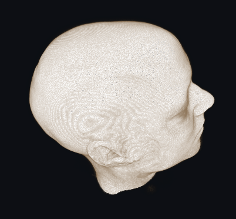

# Navian XR Engineer Challenge



Escena base de Unity para el desafío técnico de **XR Engineer** de Navian. El repo es
**autocontenido**: cloná, abrí con la versión de Unity indicada y ya vas a tener una MRI
volumétrica + 4 estructuras 3D segmentadas, **alineadas** y listas para explorar. A partir
de acá construís tu propia experiencia.

> **Todo lo que ves acá es una base para que modifiques a gusto.** Las transfer functions,
> los shaders, los materiales, los modos de render de la MRI, los meshes, los scripts
> helper... **nada está bloqueado**. Cambiá lo que quieras.

---

## Índice

1. [Cómo abrir el proyecto](#1-cómo-abrir-el-proyecto)
2. [Estructura del proyecto](#2-estructura-del-proyecto)
3. [La escena en detalle](#3-la-escena-en-detalle)
4. [La MRI volumétrica (UnityVolumeRendering)](#4-la-mri-volumétrica-unityvolumerendering)
5. [Los meshes y sus materiales](#5-los-meshes-y-sus-materiales)
6. [Todo es modificable](#6-todo-es-modificable)
7. [Dataset incluido](#7-dataset-incluido)
8. [Sobre Meta Quest](#8-sobre-meta-quest)
9. [Uso de IA](#9-uso-de-ia)
10. [Entrega](#10-entrega)
11. [Troubleshooting](#11-troubleshooting)
12. [Licencia y créditos](#12-licencia-y-créditos)

---

## 1. Cómo abrir el proyecto

- **Versión de Unity:** **`6000.4.0f1`** (Unity 6). Abrilo con esa versión exacta desde
  Unity Hub → *Add* → seleccioná la carpeta del repo.
- **Render pipeline:** **Built-in** (no requiere ningún setup extra; no es URP ni HDRP).
- **Escena principal:** [`Assets/NavianChallenge/Scenes/NavianChallenge_Main.unity`](Assets/NavianChallenge/Scenes/NavianChallenge_Main.unity).
- **Pasos:**
  1. Cloná el repo y agregalo como proyecto en Unity Hub.
  2. Abrilo (la primera vez Unity importa los assets — puede tardar unos minutos).
  3. Abrí la escena principal.
- **Qué vas a ver, apenas abrís la escena (sin darle Play):** la **MRI volumétrica** (la
  cabeza) con los **4 meshes** de segmentación adentro, todos alineados bajo un objeto raíz
  `AtlasRoot`. El volumen lo genera automáticamente un componente `[ExecuteAlways]`; hay un
  pequeño hitch de ~1-2 s la primera vez mientras se arma la textura 3D en la GPU.

---

## 2. Estructura del proyecto

```
navian-xr-challenge/
├── README.md
├── .gitignore
│
├── Assets/
│   ├── NavianChallenge/              ← TODO lo específico del desafío
│   │   ├── Scenes/
│   │   │   └── NavianChallenge_Main.unity     ← ESCENA PRINCIPAL
│   │   ├── Data/Atlas/IXI025/
│   │   │   ├── MRI/IXI025_t1.nii.gz            ← MRI T1 (se auto-importa como VolumeDataset)
│   │   │   └── Meshes/                          ← los 4 meshes 3D (.obj)
│   │   │       ├── SustanciaGris.obj  SustanciaBlanca.obj  Venas.obj  Piel.obj
│   │   ├── Materials/                 ← 1 material por estructura (editables)
│   │   ├── Scripts/                   ← helpers de runtime (mínimos, para tocar)
│   │   │   ├── AtlasVolumeLoader.cs        ← carga/crea la MRI (edición + Play)
│   │   │   └── AtlasSceneController.cs     ← cámara orbital + reset + ayuda (sin show/hide)
│   │   └── Editor/                    ← herramientas de editor (opcionales)
│   │
│   └── ThirdParty/                    ← librerías de terceros
│       ├── UnityVolumeRendering/      ← volume rendering (código fuente: Scripts, Editor,
│       │                                Shaders, Materials, Resources)
│       ├── Nifti.NET/                 ← lector NIfTI managed (soporta .nii y .nii.gz)
│       └── openDicom/                 ← dependencia DICOM de UVR
│
└── docs/images/                      ← imagen usada en este README
```

**Resumen rápido de «dónde toco X»:**

| Quiero cambiar…                         | Andá a…                                                                 |
|-----------------------------------------|-------------------------------------------------------------------------|
| La escena                               | `Assets/NavianChallenge/Scenes/NavianChallenge_Main.unity`              |
| Cómo se ve la MRI (colores/opacidad)    | Transfer Function editor + inspector de `MRI_Volume` (ver §4)           |
| El shader del volumen                   | `Assets/ThirdParty/UnityVolumeRendering/Shaders/DirectVolumeRenderingShader.shader` |
| Colores/materiales de los meshes        | `Assets/NavianChallenge/Materials/*.mat`                                |
| Carga del volumen / cámara              | `Assets/NavianChallenge/Scripts/*.cs`                                   |

---

## 3. La escena en detalle

Jerarquía de `NavianChallenge_Main.unity`:

```
AtlasRoot                                  (raíz común; en el origen, identidad)
├── MeshesRoot
│   ├── GrayMatter   (MeshFilter + MeshRenderer → GrayMatter.mat)
│   ├── WhiteMatter  (…                          → WhiteMatter.mat)
│   ├── Veins        (…                          → Veins.mat)
│   └── Skin         (…                          → Skin.mat)
├── AtlasRig
│   ├── AtlasVolumeLoader     (crea la MRI y la parenta bajo AtlasRoot)
│   └── AtlasSceneController  (cámara orbital + reset, ayuda en pantalla)
└── MRI_Volume (UnityVolumeRendering)      ← lo agrega AtlasVolumeLoader al cargar la escena
Main Camera
Directional Light
```

Notas:

- **`AtlasRoot`** es el ancla común: la MRI y los 4 meshes cuelgan de acá y **están alineados
  en el mismo espacio** (movés/rotás/escalás `AtlasRoot` y se mueve todo junto). La piel es la
  malla más externa (coincide con la superficie de la cabeza de la MRI); gris/blanca y venas
  están adentro, en el mismo espacio.
- **Materiales:** los 4 meshes arrancan con el **mismo material blanco opaco (default)**. Para
  distinguir estructuras o ver las internas vas a querer darles color/transparencia — eso es
  parte del desafío.
- **`MRI_Volume`** se genera al cargar la escena (no se guarda en el `.unity`): la textura 3D
  se arma en la GPU cada vez, así el repo se mantiene liviano y el volumen siempre correcto.
  Para forzar que se rearme: click derecho en `AtlasVolumeLoader` → **Rebuild Volume**.
- Podés reconstruir toda la escena con el menú **`Navian → Build Challenge Scene`**.

**Controles de la escena base (en Play):** solo cámara. La escena carga la MRI y los 4 meshes
**todos a la vez y visibles**; **a propósito no hay show/hide ni interacción sobre las
estructuras** — eso lo implementás vos.

| Tecla / acción       | Función                                          |
|----------------------|--------------------------------------------------|
| Arrastrar mouse      | Orbitar la cámara alrededor del atlas            |
| Rueda del mouse      | Zoom                                             |
| `R`                  | Resetear la cámara                                |
| `H`                  | Mostrar/ocultar la ayuda en pantalla             |

---

## 4. La MRI volumétrica (UnityVolumeRendering)

**Qué es:** la MRI se renderiza con
[UnityVolumeRendering (mlavik1)](https://github.com/mlavik1/UnityVolumeRendering), incluida
como **código fuente** en `Assets/ThirdParty/UnityVolumeRendering/`. El import de NIfTI usa
`Nifti.NET` (100% managed, sin DLLs nativas), que lee `.nii.gz` de forma transparente.

**De dónde sale el volumen:** `IXI025_t1.nii.gz` se auto-importa como un asset `VolumeDataset`
(gracias al *ScriptedImporter* de UVR — si arrastrás cualquier `.nii`/`.nii.gz` al proyecto
obtenés un dataset). El componente
[`AtlasVolumeLoader`](Assets/NavianChallenge/Scripts/AtlasVolumeLoader.cs) toma ese dataset y
crea el `VolumeRenderedObject` bajo `AtlasRoot`.

### Cómo modificar cómo se ve la MRI

- **Transfer Function (1D):** es *el* control principal (qué densidad → qué color y opacidad).
  Seleccioná `MRI_Volume` y abrí **`Volume Rendering → 1D Transfer Function`**. También hay
  **2D Transfer Function**.
- **Modo de render:** en el inspector de `VolumeRenderedObject`, cambiá entre **Direct Volume
  Rendering**, **MIP** e **Isosurface**. Por código: `volume.SetRenderMode(...)`.
- **Ventana de visibilidad:** `volume.SetVisibilityWindow(min, max)` (o los sliders) — útil
  para esconder piel/aire y ver el interior.
- **Iluminación / sampling / interpolación cúbica:** `SetLightingEnabled`,
  `SetSamplingRateMultiplier`, `SetCubicInterpolationEnabled`.
- **Cortes:** menú **`Volume Rendering → Cross section →`** (plano, caja, esfera) y
  **`Volume Rendering → Slice renderer`** (vistas tipo MPR).
- **El shader del raymarch:** `Assets/ThirdParty/UnityVolumeRendering/Shaders/DirectVolumeRenderingShader.shader`
  — HLSL/CG estándar, editable.

---

## 5. Los meshes y sus materiales

**Qué son:** 4 mallas 3D, **una por estructura** (sin fragmentar en miles de objetos), en
formato **`.obj`** (import nativo de Unity, sin plugins).

**Materiales** (en `Assets/NavianChallenge/Materials/`, shader `Standard`, editables):

| Estructura        | Material          | Color            |
|-------------------|-------------------|------------------|
| Sustancia gris    | `GrayMatter.mat`  | blanco (default) |
| Sustancia blanca  | `WhiteMatter.mat` | blanco (default) |
| Venas             | `Veins.mat`       | blanco (default) |
| Piel              | `Skin.mat`        | blanco (default) |

Los 4 arrancan en **blanco default** a propósito. Hay **un material por estructura** para que
puedas recolorearlas por separado (color, transparencia, shader) — diferenciarlas es parte del
desafío.

---

## 6. Todo es modificable

Esta escena es un **punto de partida**, no una app cerrada. Intervenila libremente:

- **Transfer functions** de la MRI (1D y 2D) → cambiá cómo se ve el volumen.
- **Shaders** → el del volumen, los de corte, o los tuyos.
- **Modos de render** del volumen (DVR / MIP / Isosurface), iluminación, sampling, cortes.
- **Materiales y colores** de los 4 meshes.
- **Los scripts helper** (`AtlasVolumeLoader`, `AtlasSceneController`) → reescribilos o
  reemplazalos por tu arquitectura.
- **La jerarquía y la escena** entera.

No hay nada «sagrado». Lo único que pedimos es que puedas **explicar y defender** lo que entregues.

---

## 7. Dataset incluido

- **MRI:** `IXI025` T1 — 256×256×150 voxels.
- **Estructuras (4 meshes):**
  - `1` = sustancia gris
  - `2` = sustancia blanca
  - `3` = venas
  - `4` = piel

Los datos viven dentro del proyecto (`Assets/NavianChallenge/Data/Atlas/IXI025/`), por lo que
el repo es autocontenido.

---

## 8. Sobre Meta Quest

**No hace falta Meta Quest ni ningún headset.** El desafío se evalúa desde **Desktop / Unity
Editor**. Si querés sumar XR, bienvenido, pero no es un requisito y no penalizamos no tenerlo.

---

## 9. Uso de IA

Podés usar herramientas de IA (ChatGPT, Claude, Copilot, etc.) durante el desafío. No buscamos
evaluar cuánto tiempo pasás escribiendo código desde cero, sino cómo pensás, cómo organizás la
solución y cómo llevás una idea a una experiencia funcional. Todo lo que entregues tiene que
ser algo que puedas explicar, defender y mejorar.

---

## 10. Entrega

La entrega debe ser un repositorio git con acceso publico que incluya:

- Una escena Unity ejecutable en desktop.
- Uso visible de la MRI incluida en el proyecto. Opcional: uso de los objetos 3D
- Uso de UnityVolumeRendering o integración equivalente (opcional) dentro del proyecto base.
- Una forma de interacción con la escena.
- Una funcionalidad pensada para explorar, visualizar o interpretar la información médica.
- Un README explicando:
  - qué construiste;
  - cómo ejecutarlo;
  - principales decisiones técnicas;
  - limitaciones conocidas;
  - qué mejorarías con más tiempo.

---

## 11. Troubleshooting

- **«Recovering Scene Backups» al abrir:** es la auto-recuperación de Unity por un cierre
  previo no limpio. Podés darle **No** (la escena del repo es la buena).
- **Hitch de ~1-2 s al abrir la escena o recompilar:** es la generación de la textura 3D de la
  MRI. Normal.
- **No veo la MRI en modo edición:** seleccioná `AtlasRig` → `AtlasVolumeLoader` → click
  derecho → **Rebuild Volume**.
- **Consola limpia:** `Assets/csc.rsp` silencia warnings de *API deprecada* de la librería
  UnityVolumeRendering (terceros); borralo si querés verlos en tu propio código.
- **Aviso de Input Manager:** la escena usa el Input Manager clásico por simplicidad. Unity
  sugiere migrar al *Input System package* — es opcional.

---

## 12. Licencia y créditos

- **Código propio del desafío** (escena, `Assets/NavianChallenge/`, esta documentación):
  **MIT** © Navian — ver [`LICENSE`](LICENSE).
- **Librerías de terceros** (mantienen su propia licencia): UnityVolumeRendering (MIT),
  Nifti.NET (MIT), openDicom (LGPL). Detalle en [`THIRD-PARTY-NOTICES.md`](THIRD-PARTY-NOTICES.md).
- **Dataset:** la MRI IXI025 y los meshes derivados de ella están bajo **CC BY-SA 3.0**,
  con crédito al proyecto [IXI](https://brain-development.org/ixi-dataset/). Si redistribuís
  la data o trabajos derivados, mantené la atribución y la licencia.
